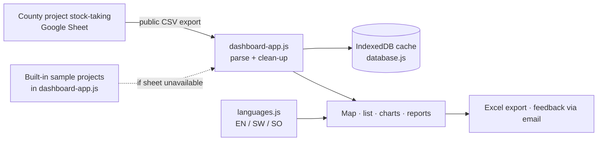

<p align="center">
  <a href="https://jmsmuigai.github.io/GARISSA-PROJECTS-MONITORING-DASHBOARD/dashboard.html"></a>
  
  
  
  <a href="https://www.tovutech.com/projects/projects-dashboard/"></a>
  <a href="https://jmsmuigai.github.io/GARISSA-PROJECTS-MONITORING-DASHBOARD/dashboard.html"></a>
</p>

## What it is

A public, trilingual (English · Kiswahili · Af-Soomaali) web dashboard for viewing and giving feedback on **Garissa County development projects**. It reads the county's project stock-taking sheet (prepared under the KDSP II project stock-taking exercise) and shows each project on a map, in lists, charts and reports — so citizens and county officers can see what is completed, ongoing or stalled, where, and with what budget.

It is a static site with no login and no backend, hosted on GitHub Pages.

## Highlights

- 🌍 **Three languages** – English, Kiswahili and Somali, switchable in the header; the choice is remembered.
- 🗺️ **Map view** – Leaflet with Esri satellite imagery or street map; markers coloured by status (completed / ongoing / stalled, Garissa Town highlighted). Projects without coordinates are placed at approximate sub-county / ward locations.
- 🔍 **Search & filters** – text search plus filters for status, sub-county, ward, department, budget range, year and source of funds, with active-filter badges.
- 📊 **Analytics** – Chart.js charts of projects by status, department, budget range and sub-county, updating with the filters.
- 📄 **Reports in the browser** – summary, completed, ongoing, stalled, budget and location reports in modal panels.
- 💬 **Per-project feedback** – feedback form on every project; stored in the visitor's browser and sent through the email client to `feedback@garissa.go.ke`.
- 📤 **Export** – Excel export of filtered projects (SheetJS); the "PDF" button currently downloads a plain-text summary.
- 🧹 **Data clean-up on load** – normalises statuses, fixes negative budgets, caps expenditure at budget, fills missing departments and validates coordinates.

## How it works



## Tech stack

| Area | Tools |
|---|---|
| Frontend | HTML5, CSS3, JavaScript (ES6+), Tailwind CSS (CDN), Lucide icons |
| Maps & charts | Leaflet 1.9 with Esri World Imagery, Chart.js |
| Data | Google Sheets CSV export, IndexedDB cache, `localStorage` (preferences and feedback) |
| Export | SheetJS (XLSX) |
| Hosting | GitHub Pages; `start-server.py` for local use |

## Getting started

**Open the live dashboard:** https://jmsmuigai.github.io/GARISSA-PROJECTS-MONITORING-DASHBOARD/dashboard.html

**Run locally:**

```bash
git clone https://github.com/jmsmuigai/GARISSA-PROJECTS-MONITORING-DASHBOARD.git
cd GARISSA-PROJECTS-MONITORING-DASHBOARD
python3 start-server.py          # serves the folder on http://localhost:8000
# then open http://localhost:8000/dashboard.html
```

**Use your own data:** make a Google Sheet with the columns in `projects_template.csv`, share it as "anyone with the link can view", and set `GOOGLE_SHEETS_ID` near the top of `dashboard-app.js`. The app tries sheet tabs such as *Summary List for Dashboard*, *Sheet1* and *Projects*.

**Deploy on GitHub Pages:** enable Pages on the `main` branch, root folder; `index.html` redirects to `dashboard.html`.

### Project data fields

Project name · description · sub-county · ward · latitude / longitude · department · status · start date · expected completion date · budget (KSh) · expenditure (KSh) · source of funds.

### Using the dashboard

- **Find a project:** type in the search box or set filters → **Search** → switch between List and Map views.
- **Reports:** open the *Reports* tab and click a report card.
- **Feedback:** click **Send Feedback** on a project card, fill in the form and submit (opens your email client).
- **Language:** click EN / SW / SO in the header.

More detail: [`docs/USER_MANUAL.md`](docs/USER_MANUAL.md), [`docs/SYSTEM_DOCUMENTATION.md`](docs/SYSTEM_DOCUMENTATION.md) and the in-app `user-manual.html`.

## Data & privacy

- **Project data:** the County's project stock-taking workbook (`Garissa County_THE_KDSP_II_PROJECT_STOCK_TAKING.xlsx`, 800+ project rows) and guideline PDFs are included; the live site reads the published Google Sheet. `projects_template.csv` is a column template with sample rows; a set of built-in sample projects in `dashboard-app.js` is shown if the sheet cannot be loaded.
- Project records are public information about county works; they contain no personal contact details.
- Citizen feedback stays in the visitor's browser until they send it by email; it is not collected by this repository or any server.

## Status & roadmap

**Status:** live demo on GitHub Pages. It displays whatever is in the source sheet; figures are only as current and accurate as that sheet.

Possible next steps:
- Store feedback in a proper backend with moderation instead of browser storage.
- Real PDF reports.
- Use surveyed project coordinates instead of approximate sub-county locations.
- Pin library versions (Chart.js, Tailwind) and bundle them for offline use.

## Security

See [SECURITY.md](SECURITY.md). Legacy apps that contained hard-coded admin credentials have been removed.

## Contact

- Project feedback: `feedback@garissa.go.ke`
- Technical: intelligence@tovutech.com

---

<p align="center">
  <b>Built by James M. Mburu · TovuTech Limited</b><br>
  <a href="https://www.tovutech.com">https://www.tovutech.com</a> · <a href="mailto:intelligence@tovutech.com">intelligence@tovutech.com</a><br>
  📖 Case study: <a href="https://www.tovutech.com/projects/projects-dashboard/">tovutech.com/projects/projects-dashboard</a>
</p>
